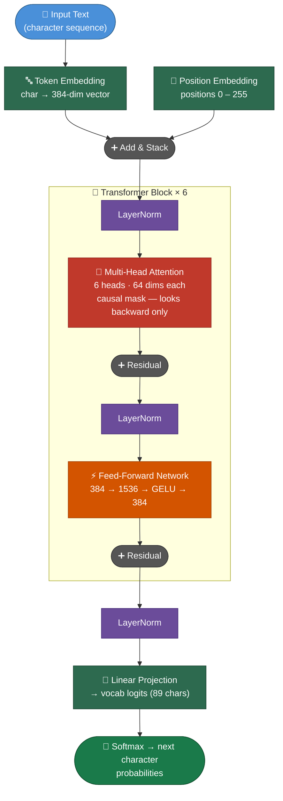
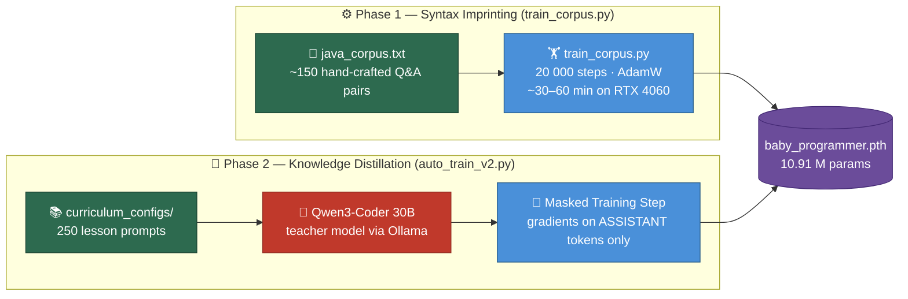
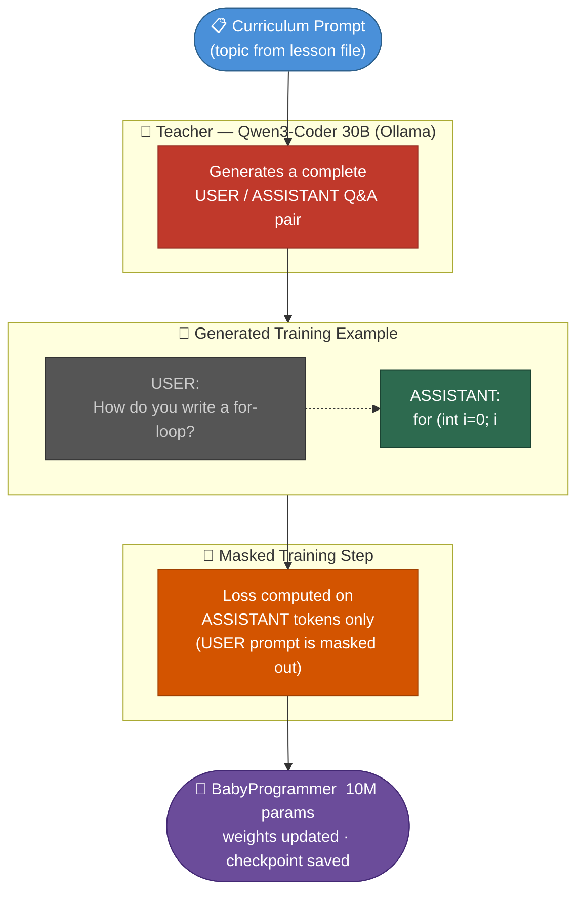

# BabyProgrammer SLM

A Small Language Model (~10.91M parameters) built completely from scratch using PyTorch.
It learns Java programming and CS fundamentals through a progressive curriculum —
starting from basic variable declarations all the way to algorithms and data structures.

Knowledge is distilled from a large local teacher model (Qwen3-Coder via Ollama)
into the small BabyProgrammer brain using a technique called **knowledge distillation**.

---

## Current Benchmark (v0.1 checkpoint)

Evaluated with `python test_baby.py` — 25 questions across 5 Java curriculum stages,
tested at temperature 0.8 with 150 generated tokens per answer.

| Stage | Score | % | Status |
|---|---|---|---|
| Stage 1: Variables & Types | 4/5 | 80% | |
| Stage 2: Control Flow | 1/5 | 20% | Needs work |
| Stage 3: Methods & Arrays | 5/5 | 100% | |
| Stage 4: OOP | 1/5 | 20% | Needs work |
| Stage 5: Advanced Topics | 1/5 | 20% | Needs work |
| **Overall** | **12/25** | **48%** | **Grade: C** |

**Vocab:** 89 characters &nbsp;|&nbsp; **Device:** CUDA &nbsp;|&nbsp; **Params:** ~10.91M

> **Grade C** — Baby is learning. Weak areas (control flow, OOP, advanced topics) improve
> with additional Qwen3-Coder distillation rounds via `auto_train_v2.py`.

<details>
<summary>Sample outputs from this checkpoint</summary>

**PASS — Variables (4/4 keywords)**
```
Q: How do you declare a double variable named price set to 9.99?
A: double price = 9.99;
```

**PASS — Arrays (4/4 keywords)**
```
Q: How do you declare an int array of size 5 in Java?
A: int[] arr = new int[5];
```

**FAIL — Control Flow (0/4 keywords)**
```
Q: Write a switch statement for an integer day with cases 1 and 2 in Java.
A: StringBuilder suflo is of a gent is an abstract class can halve define...
```

**FAIL — OOP (0/4 keywords)**
```
Q: How does a Dog class extend an Animal class in Java?
A: An algorithm is the decimal varial of a number revent nite a stop...
```
</details>

---

## Project Structure

```
BabyProgrammer/
|
|-- README.md              This file
|-- model.py               The BabyProgrammer architecture + checkpoint utilities
|-- train_corpus.py        Phase 1: teach Java syntax from hand-crafted Q&A pairs
|-- auto_train_v2.py       Phase 2: distill Qwen3-Coder knowledge via Ollama
|-- test_baby.py           Evaluation suite — 25 questions across all 5 stages
|
|-- data/
    |-- java_corpus.txt              ~150 hand-crafted USER/ASSISTANT Java Q&A pairs
    |
    |-- curriculum_configs/          Staged lesson prompts fed to Qwen during distillation
        |-- 01_variables_and_types.txt   ~40 prompts  (primitives, operators, strings)
        |-- 02_control_flow.txt          ~35 prompts  (if/else, loops, break/continue)
        |-- 03_methods_and_arrays.txt    ~50 prompts  (methods, recursion, arrays)
        |-- 04_oop_basics.txt            ~50 prompts  (classes, inheritance, interfaces)
        |-- 05_advanced_topics.txt       ~70 prompts  (algorithms, data structures, Big O)
```

---

## Architecture Overview

BabyProgrammer is a **decoder-only Transformer** — the same family of architecture
that powers modern language models like GPT. It is a character-level model, meaning
it processes and generates one character at a time rather than word tokens.



**Fixed architecture spec** — do not change these after the first checkpoint is saved:

| Parameter    | Value   | Meaning                         |
|--------------|---------|---------------------------------|
| `N_EMBD`     | 384     | Embedding dimension             |
| `N_HEAD`     | 6       | Attention heads per block       |
| `N_LAYER`    | 6       | Number of transformer blocks    |
| `BLOCK_SIZE` | 256     | Max context length (characters) |
| `DROPOUT`    | 0.2     | Regularization dropout rate     |
| Parameters   | ~10.91M | Total trainable weights         |

> All scripts import the model from `model.py`. Never copy-paste the architecture.

---

## The Training Pipeline

Training happens in two sequential phases:



---

## Phase 1: Corpus Training (`train_corpus.py`)

### What it does

Trains BabyProgrammer directly on `data/java_corpus.txt` — a file containing
~150 hand-crafted Q&A pairs in the exact format the model uses:

```
USER: How do you declare an int variable named score with value 100?
ASSISTANT: int score = 100;

USER: How do you write a for loop from 1 to 10?
ASSISTANT: for (int i = 1; i <= 10; i++) { System.out.println(i); }

USER: How do you write a recursive method for factorial?
ASSISTANT: public static int factorial(int n) { if (n <= 1) return 1; return n * factorial(n - 1); }
```

### Why this step is critical

Without this step, the model has only seen textbook prose (English sentences).
It has almost no exposure to Java syntax — no `{`, `;`, `return`, `extends`, `for`.
This corpus teaches the model:

- The `USER: ... \nASSISTANT: ...` Q&A format it must follow
- All core Java keywords and symbols in meaningful context
- The association between questions and correct code answers

### Step-by-step walkthrough

**Step 1 — Load and tokenize the corpus**

```python
with open(CORPUS_PATH, 'r', encoding='utf-8') as f:
    text = f.read()

chars      = sorted(set(text))                        # all unique characters
vocab_size = len(chars)                               # e.g. 95 chars
stoi       = {ch: i for i, ch in enumerate(chars)}   # char -> integer index
itos       = {i: ch for i, ch in enumerate(chars)}   # integer index -> char
```

The entire corpus is flattened into a sequence of integers.
`"int"` might become `[47, 56, 62]` depending on the sorted character order.
This integer sequence is what the model actually trains on.

**Step 2 — Split train / validation**

```python
n = int(0.95 * len(data))
train_data, val_data = data[:n], data[n:]
```

95% trains the model. 5% is held out as a validation set to detect overfitting.
The corpus is small (~15,000 chars) so most goes to training.

**Step 3 — Load or warm-start the model**

```python
if os.path.exists(MODEL_PATH):
    model = bridge_weights(MODEL_PATH, vocab_size, stoi)
else:
    model = BabyProgrammer(vocab_size).to(device)
```

If a checkpoint already exists, the **bilingual bridge** transfers its weights into
the new vocabulary. Characters that exist in both old and new vocab keep their
learned embeddings. New characters start from zero.

If no checkpoint exists, the model starts with random weights.

**Step 4 — Batch sampling**

```python
def get_batch(data, block_size, batch_size):
    ix = torch.randint(len(data) - block_size, (batch_size,))
    x  = torch.stack([data[i     : i + block_size    ] for i in ix])
    y  = torch.stack([data[i + 1 : i + block_size + 1] for i in ix])
    return x.to(device), y.to(device)
```

Each step draws 32 random windows of 256 characters from the corpus.
`x` is the input, `y` is the same window shifted one position right.
The model's goal: given `x`, predict `y` — i.e., predict the next character.

**Step 5 — The training loop**

```python
for step in range(MAX_ITERS):       # 20,000 steps
    xb, yb = get_batch(...)
    _, loss = model(xb, yb)         # forward pass computes cross-entropy loss
    optimizer.zero_grad(set_to_none=True)
    loss.backward()                 # backpropagate gradients through all layers
    optimizer.step()                # update weights with AdamW
```

**Cross-entropy loss** measures how surprised the model is by the correct next character.

```
loss ~4.5  →  guessing randomly (1/95 chars ≈ chance)
loss ~2.5  →  has learned basic patterns
loss ~1.5  →  confidently predicting most characters correctly  (target)
loss ~1.0  →  strong memorization of the corpus
```

**Step 6 — Checkpoint and sanity generation**

Every 1,000 steps the checkpoint is saved to `baby_programmer.pth`.
At the end, three test prompts are generated so you can spot-check the output.

### Expected loss curve

```
Step      0  |  train ~4.50  val ~4.50   (random guessing)
Step   1000  |  train ~2.80  val ~2.90
Step   5000  |  train ~1.80  val ~1.95
Step  10000  |  train ~1.40  val ~1.60
Step  20000  |  train ~1.10  val ~1.40   (good target)
```

### How to run

```bash
python train_corpus.py
```

---

## Phase 2: Knowledge Distillation (`auto_train_v2.py`)

### What it does

Uses **Qwen3-Coder** (a 30B expert model running locally via Ollama) as a teacher.
For each topic in the curriculum the teacher generates a perfect training example.
BabyProgrammer then trains directly on that example — focusing only on the answer.

This is **knowledge distillation**: a large capable model transfers its knowledge
into a much smaller model by producing high-quality training data on demand.



### Prerequisites

```bash
# 1. Install and start Ollama (if not already running)
ollama serve

# 2. Pull the teacher model — do this once
ollama pull qwen3-coder:30b    # ~19GB, best quality
# OR if VRAM is tight:
ollama pull qwen3-coder:8b     # ~5GB, still a strong teacher

# 3. Phase 1 must be done first
python train_corpus.py
```

### Step-by-step walkthrough

**Step 1 — Load the checkpoint**

```python
model, stoi, itos, vocab_size = load_checkpoint(MODEL_PATH)
optimizer = torch.optim.AdamW(model.parameters(), lr=1e-4)
```

The vocabulary (`stoi`/`itos`) is loaded from the checkpoint.
This must stay consistent — the encode/decode functions depend on it.

**Step 2 — Walk through curriculum files in sorted order**

```python
curriculum_files = sorted(CURRICULUM_DIR.glob('*.txt'))
# 01_variables_and_types.txt
# 02_control_flow.txt
# 03_methods_and_arrays.txt
# 04_oop_basics.txt
# 05_advanced_topics.txt
```

Files are processed in numerical order — basics before advanced.
This mirrors how a real student learns: types before loops, loops before OOP.

**Step 3 — Ask the Oracle (Qwen) for each topic**

```python
def ask_oracle(topic: str) -> str:
    system_prompt = (
        "You are a Senior CS Professor creating a training example.\n"
        f"Topic: {topic}\n\n"
        "Respond in exactly this format:\n"
        "USER: [one clear question]\n"
        "ASSISTANT: [exact Java code or explanation]"
    )
    resp = requests.post('http://localhost:11434/api/generate', json={
        'model':      'qwen3-coder:30b',
        'prompt':     system_prompt,
        'stream':     False,
        'keep_alive': -1,    # keep Qwen in VRAM between calls — critical for speed
    })
    return resp.json().get('response', '').strip()
```

`keep_alive: -1` keeps Qwen loaded in VRAM between calls.
Without it, Ollama unloads the model after each request — adding ~30s per lesson.

Example of what Qwen returns:
```
USER: How do you declare a final constant MAX_SIZE with value 100 in Java?
ASSISTANT: final int MAX_SIZE = 100;
```

**Step 4 — Masked loss (the key technique)**

Standard LM training learns to predict every token — including the USER question.
We only want the model to learn the **ASSISTANT answer**, not replay the question.

```python
# Find the token position where ASSISTANT: ends
assistant_tag = encode("ASSISTANT:")
for i in range(len(tokens) - len(assistant_tag)):
    if tokens[i : i + len(assistant_tag)] == assistant_tag:
        mask_start = i + len(assistant_tag)
        break

# mask = 0 for USER prompt tokens, 1 for ASSISTANT answer tokens
mask = torch.zeros(T, device=device)
mask[mask_start:] = 1.0

# Loss computed only on answer tokens
loss        = F.cross_entropy(logits.view(B*T, C), y.view(B*T), reduction='none')
masked_loss = (loss * mask).sum() / (mask.sum() + 1e-8)
```

Gradient steps only flow through the answer portion.
The model improves at generating correct answers, not at copying questions.

**Step 5 — Save after every lesson**

```python
save_checkpoint(MODEL_PATH, model, stoi, itos, vocab_size)
```

The checkpoint is saved after every single lesson.
If Ollama times out or you stop the script, no progress is lost.

**Step 6 — Repeat across all 5 curriculum stages**

A full run processes ~250 prompts across the five stages.
Run the script multiple times to reinforce learning — each pass deepens the patterns.

### Expected console output

```
============================================================
  STAGE: 02_control_flow.txt  (35 lessons x 1 epoch)
============================================================

  Lesson 1/35: How do you write an if statement that prints Adult if age...
  Oracle: USER: Write an if statement in Java... ASSISTANT: if (age >= 18) {
  Loss: 1.2341

  Lesson 2/35: How do you write an if-else statement...
  Oracle: USER: Write an if-else block... ASSISTANT: if (age >= 18) { ...
  Loss: 0.9823
```

Loss below 1.0 on a lesson means BabyProgrammer is predicting the teacher's
answer confidently, character by character.

---

## Running the Full Pipeline

```bash
# Step 1 — Teach Java syntax from the hand-crafted corpus (no Ollama needed)
python train_corpus.py

# Step 2 — Check where the model stands
python test_baby.py --temp 0.7

# Step 3 — Start Ollama in a separate terminal
ollama serve

# Step 4 — Run knowledge distillation through all 5 curriculum stages
python auto_train_v2.py

# Step 5 — Evaluate improvement
python test_baby.py --temp 0.7

# Step 6 — Run again for deeper reinforcement (optional, improves score further)
python auto_train_v2.py
python test_baby.py --temp 0.7
```

---

## Evaluation (`test_baby.py`)

25 questions across all 5 curriculum stages. Each answer is checked for
expected keywords. A question passes if at least 2 keywords are found.

```bash
python test_baby.py              # default: temp=0.8, 150 tokens
python test_baby.py --temp 0.5   # more deterministic — better for code
python test_baby.py --tokens 250 # longer answers
```

Sample output:
```
######################################################################
  FINAL REPORT
######################################################################
  Model    : baby_programmer.pth
  Device   : cuda
  Vocab    : 95 chars

  [#####]  5/5  (100%)  Stage 1: Variables & Types
  [####.]  4/5  ( 80%)  Stage 2: Control Flow
  [####.]  4/5  ( 80%)  Stage 3: Methods & Arrays
  [###..]  3/5  ( 60%)  Stage 4: OOP
  [###..]  3/5  ( 60%)  Stage 5: Advanced Topics

  OVERALL: 19/25 questions passed  (76%)
  Grade: B  -- Baby knows the basics, needs more distillation.
######################################################################
```

| Score   | Grade | Meaning                                    |
|---------|-------|--------------------------------------------|
| 80-100% | A     | Solid programmer — knows its Java           |
| 60-79%  | B     | Knows basics, run more distillation rounds  |
| 40-59%  | C     | Learning — run more Qwen distillation       |
| 20-39%  | D     | Needs more training data + Ollama sessions  |
| 0-19%   | F     | Still babbling — run Phase 1 first          |

---

## Data Samples

### `data/java_corpus.txt`

```
USER: How do you declare an int variable named score with value 100?
ASSISTANT: int score = 100;

USER: How do you write a for loop from 1 to 10?
ASSISTANT: for (int i = 1; i <= 10; i++) { System.out.println(i); }

USER: How do you define a recursive method for factorial?
ASSISTANT: public static int factorial(int n) { if (n <= 1) return 1; return n * factorial(n - 1); }

USER: What is encapsulation in Java?
ASSISTANT: Encapsulation hides internal data using private fields and provides
public getter and setter methods. Example: private int balance; public int getBalance() { return balance; }

USER: How do you use a HashMap in Java?
ASSISTANT: HashMap<String, Integer> map = new HashMap<>(); map.put("Alice", 95); int grade = map.get("Alice");
```

### `data/curriculum_configs/01_variables_and_types.txt` (sample)

```
How do you declare an int variable named score with value 100 in Java?
How do you use the modulo operator in Java to check if a number is even?
How do you cast a double to an int in Java?
How do you use StringBuilder to build a String efficiently in Java?
What is the difference between == and equals when comparing Strings in Java?
```

### `data/curriculum_configs/05_advanced_topics.txt` (sample)

```
How do you write bubble sort in Java?
How do you implement a binary search on a sorted array?
How do you implement a Stack class using an ArrayList?
What is O(n squared) time complexity? Give a Java example.
How do you use Stream filter to get only even numbers from a list?
How do you detect a cycle in a linked list in Java?
```

---

## Tips and Troubleshooting

**Ollama is slow between lessons**
`keep_alive: -1` is already set in `auto_train_v2.py`. This keeps Qwen in VRAM.
Without it, the model evicts and reloads every call, adding ~30s per lesson.

**Not enough VRAM for qwen3-coder:30b alongside BabyProgrammer**
Change `OLLAMA_MODEL = 'qwen3-coder:8b'` at the top of `auto_train_v2.py`.
The 8b model is a strong teacher for all Java basics and OOP concepts.

**Loss not going down in train_corpus.py**
Lower the learning rate: change `LEARNING_RATE = 5e-4` to `1e-4`.
Or increase `MAX_ITERS` to 30000 for more passes over the small corpus.

**Test score is stuck after distillation**
Run `python auto_train_v2.py` a second and third time.
Each pass revisits all 250 lessons, deepening the weight patterns.

**Model generates gibberish**
Lower temperature: `python test_baby.py --temp 0.3`.
High temperature = more randomness. For code, 0.3–0.6 works best.

**Never change the architecture constants in `model.py` after saving a checkpoint.**
If `N_EMBD`, `N_HEAD`, `N_LAYER`, or `BLOCK_SIZE` change, the saved weights
will not load and you will need to retrain from scratch.

---

## File Reference

| File | Purpose | Run when |
|---|---|---|
| `model.py` | Architecture + save/load utilities | Imported by all scripts |
| `train_corpus.py` | Phase 1 — Java syntax imprinting | First, always |
| `auto_train_v2.py` | Phase 2 — Qwen distillation | After Phase 1 |
| `test_baby.py` | Evaluate the model | Anytime |
| `data/java_corpus.txt` | Hand-crafted Q&A training pairs | Used by train_corpus.py |
| `data/curriculum_configs/` | Lesson prompts for distillation | Used by auto_train_v2.py |
