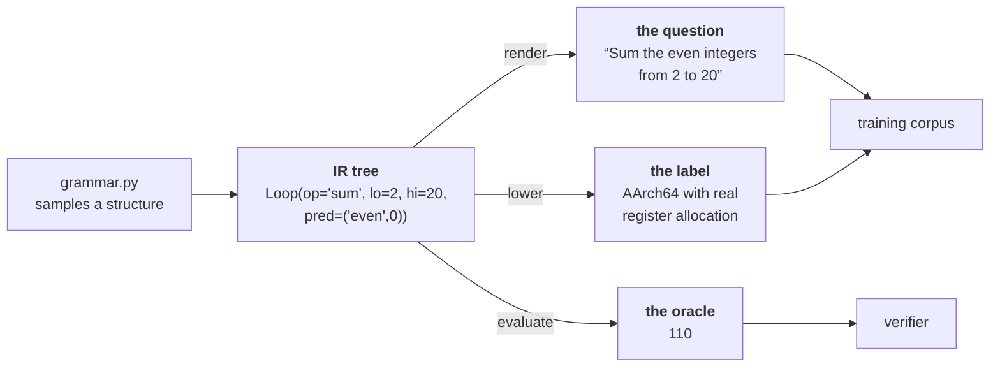
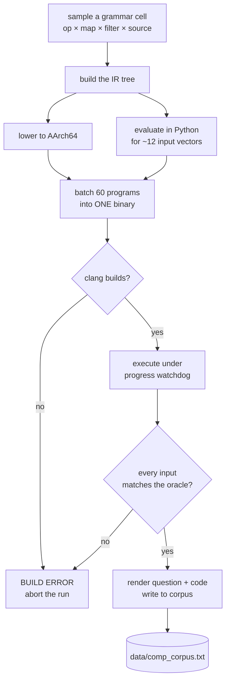
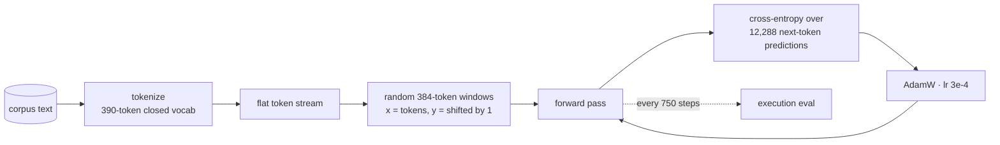
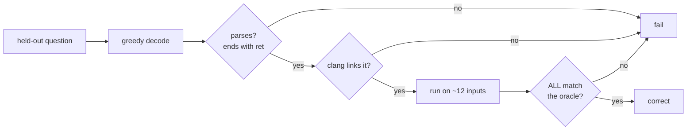

# baby-programmer

A **25.8M-parameter** language model that writes AArch64 assembly from plain-English
descriptions and answers basic questions about the instruction set — trained
entirely on a corpus where **every single example was compiled and executed
before it was allowed to become training data**.

No scraped code. No assumed-correct labels. 26,000 programs, ~312,000 executions,
zero unverified samples.

```
USER: Work out how many of the elements of the array that are divisible by 4;
      the answer belongs in w0. The array pointer is in x0 and its length in w1.

ASSISTANT:
    mov x10, x0
    mov w11, w1
    mov w1, #0
    mov w2, w11
    mov w0, #0
loop1:
    cmp w1, w2
    b.ge done2
    ldr w3, [x10, w1, uxtw #2]
    and w4, w3, #3
    cmp w4, #0
    b.ne skip3
    add w0, w0, #1
skip3:
    add w1, w1, #1
    b loop1
done2:
    ret
```

That program is correct on every test input, at array lengths the model never
saw during training.

---

## Results

Measured by **compiling and running** the model's output against a reference
oracle on ~12 inputs each. A program counts as correct only if **every** input
matches.

| Evaluation | What it tests | Builds | Correct |
|---|---|---:|---:|
| **seen** | trained program shapes, new constants | 100% | **90.5%** |
| **combo** | *unseen combinations* of trained operations | 100% | **83.0%** |
| **size** | trained on arrays ≤ 8, tested at 12 and 16 | 100% | **86.0%** |
| **facts** | held-out questions about the ISA | — | **95.0%** |
| **depth** | expressions nested deeper than any in training | 98.5% | **5.5%** |

Three of those are the headline. `combo` says it composes operations it was
never shown together. `size` says it learned an *algorithm*, not a per-length
template. `depth` is the honest failure, documented in
[Known limits](#known-limits).

---

## Quickstart

```bash
python3.11 -m venv .venv && .venv/bin/pip install torch

# generate and verify a corpus (every program compiled + executed)
.venv/bin/python arm/build_corpus.py --n 20000 --out data/comp_corpus.txt

# prove the generator agrees with hand-written ground truth
.venv/bin/python arm/golden.py

# train
.venv/bin/python arm/train_comp.py --steps 3000 --n-embd 512 --n-head 8 \
    --n-layer 8 --facts 2500 --tag mymodel
```

Requires `clang` (ships with Xcode command line tools) — the corpus is verified
by actually assembling and running it.

---

## Try it yourself

`arm/ask.py` talks to the trained model directly. With `--run` it assembles what
the model wrote, executes it, and prints the value actually left in `w0`.

```bash
# a factual question
.venv/bin/python arm/ask.py "What does the cset instruction do?"

# generate code, run it, and check against what you expect
.venv/bin/python arm/ask.py --run --expect 110 \
  "Compute the sum of the even integers from 2 to 20, leaving the result in w0."

# array questions: supply the input data
.venv/bin/python arm/ask.py --run --array 4,9,2,7,30 --expect 52 \
  "Compute the sum of the elements of the array, leaving the result in w0. \
   The array pointer is in x0 and its length in w1."

# scalar arguments
.venv/bin/python arm/ask.py --run --args 12,188 --expect 188 \
  "Compute w0 if w0 is at least w1, otherwise w1, leaving the result in w0. \
   The inputs are in w0, w1."

# interactive; prefix a question with ! to also run it
.venv/bin/python arm/ask.py
```

### Verified examples

Every one of these was run against the shipped checkpoint:

| Question | Expected | Result |
|---|---:|:--|
| sum of the even integers from 2 to 20 | 110 | **PASS** |
| product of the odd integers from 2 to 20 | 654,729,075 | **PASS** |
| sum of the squares of the integers from 1 to 5 | 55 | **PASS** |
| sum of the elements of `[4,9,2,7,30]` | 52 | **PASS** |
| largest of the elements of `[3,17,8,12]` | 17 | **PASS** |
| how many elements of `[4,20,11,9,30]` exceed 10 | 3 | **PASS** |

The product case is worth noting: nine digits, composed from `product` × `odd`
× a range, correct exactly. `--run` reports the full 32-bit result — an earlier
version read the value from the process exit status, which is only the low byte
and reported 115 instead of 654,729,075. The model was right; the read-out was
lying.

### Phrase questions the way the corpus does

**This matters, and it is a real limitation.** The 16 surface phrasings vary
only the *wrapper* — "Compute X…", "I need X…", "Emit code for X…". The **body**
that names the operation has exactly one rendering. Stray from it and the model
matches the nearest familiar shape and silently substitutes a different
operation:

| use this | not this |
|---|---|
| `the sum of the elements of the array` | "Sum the array" |
| `the largest of the elements of the array` | "Find the max" |
| `the sum of the even integers from 2 to 20` | "Add up the evens up to 20" |
| `how many of the elements of the array that are greater than 10` | "Count elements over 10" |

Asked *"Sum the elements of the array"*, the model produced a max-with-filter
loop and returned a wrong answer without any sign of confusion. Giving `show()`
in `ir.py` several renderings per node — the treatment the wrapper already got —
is the highest-value remaining fix.

To see the exact forms it knows:

```bash
.venv/bin/python -c "
import sys; sys.path.insert(0,'arm')
import grammar; from ir import question
for p in grammar.sample(12, seed=7): print(question(p))"
```

---

## The core idea: one IR, three views

The unit of data is not a string. It is a sampled **IR tree** — an
*intermediate representation*, the same concept a compiler uses internally.
Everything else is derived from that one object.


```mermaid
flowchart LR
    G[grammar.py<br/>samples a structure] --> IR["<b>IR tree</b><br/>Loop(op='sum', lo=2, hi=20,<br/>pred=('even',0))"]
    IR -->|render| Q["<b>the question</b><br/>“Sum the even integers<br/>from 2 to 20”"]
    IR -->|lower| A["<b>the label</b><br/>AArch64 with real<br/>register allocation"]
    IR -->|evaluate| O["<b>the oracle</b><br/>110"]
    Q --> C[training corpus]
    A --> C
    O --> V[verifier]
```

Why this matters: written as three separate strings, the question, the code and
the expected answer can disagree — and across 20,000 programs, some would.
Because all three are derived from one `Loop(...)`, **the question cannot
describe something the code does not do**. Change `pred` to `('odd', 0)` and the
sentence, the branch instruction and the answer all change together.

`lower()` and `evaluate()` are **independent implementations** of the same
semantics — one emits machine code, the other interprets in Python. Neither is
derived from the other, so a codegen bug shows up as an execution mismatch. A
verifier that ran the same code twice would prove nothing.

---

## How the training corpus is created


```mermaid
flowchart TD
    A[sample a grammar cell<br/>op × map × filter × source] --> B[build the IR tree]
    B --> C[lower to AArch64]
    B --> D[evaluate in Python<br/>for ~12 input vectors]
    C --> E[batch 60 programs<br/>into ONE binary]
    D --> E
    E --> F{clang builds?}
    F -->|no| X[BUILD ERROR<br/>abort the run]
    F -->|yes| G[execute under<br/>progress watchdog]
    G --> H{every input<br/>matches the oracle?}
    H -->|no| X
    H -->|yes| I[render question + code<br/>write to corpus]
    I --> J[(data/comp_corpus.txt)]
```

**Step by step:**

1. **Sample a grammar cell.** The grammar is mostly one form —
   `reduce(op, map(f, filter(pred, source)))` — where each axis varies
   independently: 5 reduce ops (`sum`, `product`, `count`, `min`, `max`),
   6 maps, 6 predicates, 3 sources (integer range, literal array, caller's
   array). That plus expression trees and conditionals gives **~5,200 distinct
   program shapes** across 417 grammar cells.

2. **Lower it.** Register allocation is a deterministic function of program
   structure — a node lowered into `dst` with free index `f` may only touch
   `w{f}..w9`, and `dst` is always below `f`. Deterministic matters: an earlier
   version picked registers at random, which made the choice unpredictable from
   the question and therefore pure noise in the training target.

3. **Choose input vectors.** Edges first — empty array, single element,
   `lo == hi`, `lo > hi`, negatives, all-equal, sorted — then random. Edge cases
   are where off-by-one loop bounds actually surface.

4. **Verify by execution.** 60 programs are compiled into a *single* binary,
   each writing one pass/fail byte as it finishes. This is not a micro-
   optimisation: on macOS the first run of a freshly built binary pays an
   OS code-signing check (~0.45s) that is serialised machine-wide, so one
   process per program is unusably slow. Batching took full-corpus verification
   from **323s for 600 programs to 34s for 20,000**.

5. **Handle non-termination.** A generated program that hangs would stall the
   whole batch. Because each program writes a byte as it completes, the partial
   output names exactly which one stalled; it is charged to itself and the rest
   is re-run. Detection is based on **progress, not elapsed time** — a fixed
   deadline cannot distinguish "hung" from "slow to start" when the OS is
   serialising code-signing checks across parallel workers.

6. **Write only what passed.** Anything that fails aborts the build. A program
   that disagrees with its own label is a generator bug, not a noisy sample.

### The one thing execution cannot check

If the IR's *meaning* is misunderstood, the assembly and the oracle inherit the
same mistake, agree perfectly, and verification goes green on a program that
answers the wrong question. This is not hypothetical — it happened twice:

- A nested expression rendered as `"21 plus 95 times 42"`, which by ordinary
  precedence means `21 + (95 × 42)`, while the tree meant `(21 + 95) × 42`.
- An array loop with a filter rendered *identically* to one without, silently
  dropping the word that changed the code.

Both were correct-by-execution and **wrong as training data**. The guard is
`arm/golden.py` — 68 hand-written cases whose expected values *and question
text* were worked out by hand and never derived from the generator. It covers
all three views, because execution can validate two of them and is structurally
blind to the third.

```bash
$ .venv/bin/python arm/golden.py
oracle vs hand-written:        44/44 agree
compiled code vs hand-written: 44/44 agree
question text vs hand-written:   7/7 agree
array cases vs hand-written:   34/34 agree
GOLDEN SET PASSES
```

---

## Training


```mermaid
flowchart LR
    C[(corpus text)] --> T[tokenize<br/>390-token closed vocab]
    T --> D[flat token stream]
    D --> B["random 384-token windows<br/>x = tokens, y = shifted by 1"]
    B --> M[forward pass]
    M --> L["cross-entropy over<br/>12,288 next-token predictions"]
    L --> U[AdamW · lr 3e-4]
    U --> M
    M -.every 750 steps.-> E[execution eval]
```

**Tokenizer.** Assembly has a genuinely finite vocabulary, so tokens are matched
by regex, longest-first, with **no BPE and no learned merges**. Two decisions
carry weight:

- **Mnemonics and registers are atomic.** `mov` is one token, `b.ge` is one
  token. The model cannot emit `mvo` or a malformed register *at all* — invalid
  output is unrepresentable rather than merely unlikely.
- **Numbers are split into digits.** Slightly worse compression, but copying a
  value from question to answer becomes a task over a 10-symbol alphabet that
  generalises to magnitudes never seen in training.

**Model.** 8 layers × 8 heads × 512 dims, pre-norm residual blocks, fused QKV
projection, learned absolute position embeddings, block size 384.

**Where the parameters live** — two thirds is feed-forward; the embeddings are
nearly free because the vocabulary is 390 rather than 50,000:

| Component | Share |
|---|---:|
| feed-forward | 65% |
| attention (qkv + proj) | 33% |
| embeddings + head + norms | 2% |

---

## Evaluation

Validation loss is **not** used as a success metric, for a measured reason: in
one run it went flat at step 1,000 (0.270 → 0.243) while execution accuracy
climbed from 37% to 95%. Watching loss alone, that run looked converged 3,000
steps before it was.


```mermaid
flowchart LR
    Q[held-out question] --> G[greedy decode]
    G --> P{parses?<br/>ends with ret}
    P -->|no| F[fail]
    P -->|yes| BL{clang links it?}
    BL -->|no| F
    BL -->|yes| R[run on ~12 inputs]
    R --> CK{ALL match<br/>the oracle?}
    CK -->|no| F
    CK -->|yes| OK[correct]
```

Linking matters, not just assembling: `b loop` with no `loop:` label assembles
fine and only fails at link time — and a loop with a missing label is exactly
the mistake this model makes.

**Why per-program and not per-answer.** An earlier version ran each program
once. It scored a hardcoded `ldr w0, [sp, #4]` as a working "find the largest
element", because index 1 happened to hold the maximum. Single-input scoring
overstated accuracy by **8 points** and overstated it *most* on the shapes that
were most broken — a metric that flatters failure is worse than no metric.

**Why held out by structure, not by constants.** Varying the numbers in a
question while the shape stays in training measures memorisation of values. The
splits here remove whole *grammar cells* — every `product × square × even`
program — while `product`, `square` and `even` each stay in training elsewhere.
Only the **combination** is new.

---

## Sample runs

All output below is real, generated by `checkpoints/goal_25M.pth` and executed.

### Composed loop with a filter and a map

```
USER: Calculate the largest of the squares of the even integers from 22 to 31
      and place the result in w0.

    mov w1, #22
    mov w2, #31
    mov w0, #0
    mov w4, #0          ← "have a value yet" flag
loop1:
    cmp w1, w2
    b.gt done2
    mov w3, w1
    and w5, w3, #1      ← the "even" filter
    cmp w5, #0
    b.ne skip3
    mul w3, w3, w3      ← the "squares" map
    cmp w4, #0
    b.ne seed4
    mov w0, w3          ← first kept value seeds the max
    mov w4, #1
    b keep5
seed4:
    cmp w3, w0
    b.le keep5
    mov w0, w3
keep5:
skip3:
    add w1, w1, #1
    b loop1
done2:
    ret

→ CORRECT on all 12 test inputs
```

Every qualifier in the sentence changed the code: *largest* produced the
seed-and-compare accumulator, *squares* the `mul`, *even* the `and`/`cmp` filter.

### Arguments, not constants

```
USER: Assembly please: the largest of the odd integers from w0 to w1,
      each increased by 8, result in w0. The inputs are in w0, w1.

    mov w10, w0         ← park arguments clear of temporaries
    mov w11, w1
    ...
    and w5, w3, #1
    cmp w5, #1          ← odd
    b.ne skip3
    mov w5, #8
    add w3, w3, w5      ← each increased by 8
    ...
→ CORRECT on all 12 test inputs
```

### Factual questions

```
USER: What happens when I write sub?
ASSISTANT:
sub subtracts the second value from the first. For example,
sub w0, w1, w2 means w0 holds w1 - w2.

USER: Explain how a comparison works.
ASSISTANT:
cmp sets flags describing the subtraction, then a conditional branch
or cset reads those flags. cmp itself changes no register.
```

A real failure, for honesty — asked to explain `movk`, the model produced the
right sentence but wrote `#9999` where the reference says `#999`. The digit-copy
skill that is reliable inside assembly is weaker inside prose.

---

## Repository layout

| Path | Role |
|---|---|
| `arm/ir.py` | IR node types, the oracle, the question renderer |
| `arm/lower.py` | IR → AArch64, deterministic register allocation |
| `arm/grammar.py` | samples IR structures; defines grammar cells |
| `arm/verify_ir.py` | batch compile + execute + compare against the oracle |
| `arm/watchdog.py` | progress-based hang detection |
| `arm/golden.py` | hand-written ground truth for all three views |
| `arm/split.py` | held-out cells, input sizes, depths |
| `arm/facts.py` | factual ISA question/answer pairs |
| `arm/tokenizer.py` | closed-vocabulary reversible tokenizer |
| `arm/build_corpus.py` | generate + verify + write a corpus |
| `arm/train_comp.py` | training loop with five evaluation metrics |
| `arm/eval_comp.py` | generate → build → execute → compare |
| `arm/ask.py` | ask the model questions by hand |
| `model.py` | the transformer |

---

## Known limits

**It composes, but it does not recurse.** Asked for an expression nested one
level deeper than anything in training, it emits well-formed, compiling code
that is systematically *too short* — a depth-3 program for a depth-4 question.
Move the training ceiling from 3 to 4 and the failure moves to 5. It learned a
maximum depth, not a recursion.

This survived every lever tried:

| Attempted fix | Depth score |
|---|---:|
| 1.9M parameters | 0.5% |
| 10.9M parameters | 3.0% |
| 25.5M parameters | 2.5% |
| train deeper (≤4), test at 5 | 0.5% |
| plan-then-code decomposition | 0.7% |

The decomposition experiment localised it: given a place to write the steps out
first, on deep problems the model produced a correct decomposition **0.0%** of
the time and the right *number* of steps only 24.7%. It cannot break down a deep
problem, because breaking it down is itself the recursive act.

**What that means practically.** The model handles any single-level program
composed from operations it knows, over inputs of any size. It cannot build
structure whose shape it has not been shown. For a bounded domain that is often
enough; for open-ended programming it is not.

**Other limits worth knowing:**
- Learned absolute position embeddings cannot extrapolate past `block_size`.
  Longer programs need rotary or ALiBi, not just a bigger number.
- The factual Q&A is *trusted, not verified* — you cannot execute an English
  sentence. It is deliberately small, hand-written, and scoped to the
  instruction subset the generator actually emits.
- No division. `udiv`/`sdiv` are outside the instruction subset.

---

## What scales

Measured, not guessed:

| Lever | Effect |
|---|---|
| **more parameters** | composition 30% → 63.5% → 82% across 1.9M → 10.9M → 25.5M, still climbing |
| **KV cache** | generation 2.56s → 0.40s, byte-identical output |
| **fused attention** | step time 924ms → 360ms, verified identical math |
| **decomposition** | +9 points at 10.9M, **nothing at 25.5M** — a capacity aid, not a free win, so it was dropped |
| **deeper training data** | no effect on depth extrapolation |

Untried and likely worthwhile: cosine LR decay with warmup (the observed
85 → 66 → 93 oscillation at flat loss is what a too-high late LR looks like),
masking loss to the answer only (about a third of each step is currently spent
predicting prompts), bf16 autocast, and `torch.compile`.
